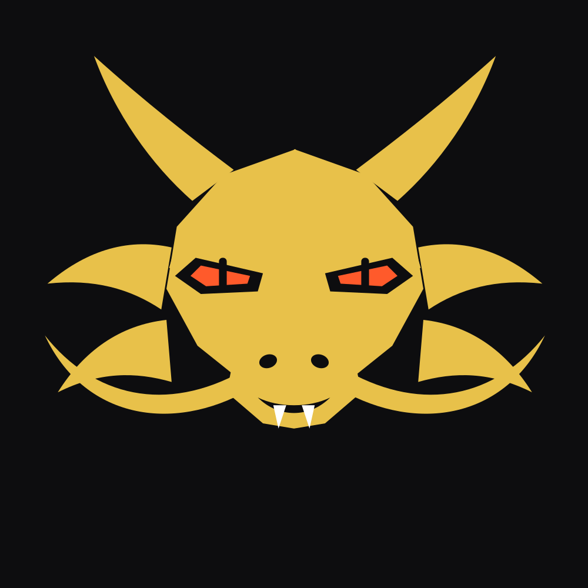

# Dragón — set de iconos

Dos dibujos vectoriales originales (no el emoji 🐲), en varias paletas.
Todo es SVG: nítido a cualquier tamaño y recoloreable.

## Variantes

| Archivo | Dibujo | Paleta |
|---|---|---|
| `perfil-oro` | cabeza de perfil, fauces abiertas | oro sobre negro |
| `perfil-jade` | cabeza de perfil | jade sobre verde oscuro |
| `perfil-carmin` | cabeza de perfil | rojo sobre negro |
| `mascara-oro` | máscara frontal simétrica | oro sobre negro |
| `mascara-jade` | máscara frontal | jade sobre verde oscuro |
| `mascara-carmin` | máscara frontal | rojo sobre negro |
| `mascara-hueso` | máscara frontal | negro sobre hueso |
| `mascara-hielo` | máscara frontal | azul sobre azul noche |

Cada una está en `.svg` (vector) y `.png` (1000×1000).
`_muestras.png` es la hoja de contacto con todas, recortadas en círculo.

## Uso

**Foto de perfil (WhatsApp, Telegram, etc.)** — usa el `.png`. Está
compuesto dentro del círculo de recorte, así que no se cortan los cuernos.

**Web**
```html

```

**Regenerar / cambiar colores**
```bash
node _build.js
```
Las paletas están en el objeto `P` de `_build.js`. Añade una entrada y
súmala al array `variants`.

## Licencia
MIT, igual que el resto del repo. Dibujo original.
